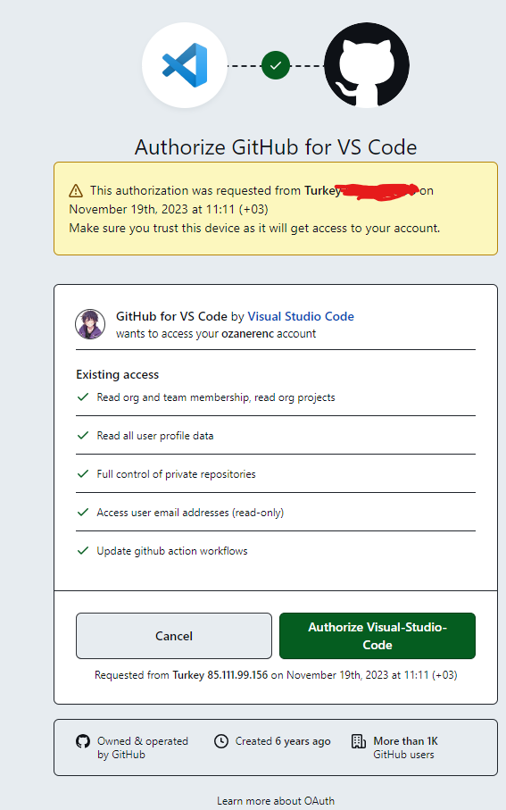
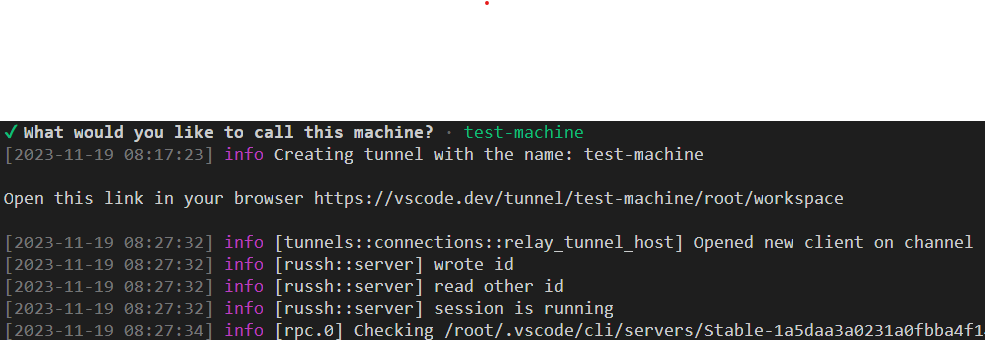
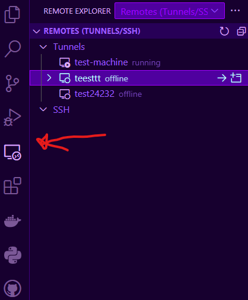

### Code Tunnel Application

First, if you haven't downloaded the code server tool, download it:
```bash
curl -Lk 'https://code.visualstudio.com/sha/download?build=stable&os=cli-alpine-x64' --output vscode_cli.tar.gz

tar -xf vscode_cli.tar.gz
```
Then, run the tool:

```bash
./code tunnel
```
In the prompt that follows, choose  ***Github***.

Next, you'll receive an 8-digit auth-key, marked with red in the example. Do not share this key as it provides access to your Github account. 


Enter this key on [this link](https://github.com/login/device).


Grant access permission to your account on the screen that follows.


After this step, you need to name your machine. Choose a name without using Turkish characters. You will use this name later.


You may need to wait for 5-10 seconds after this step. When it's ready for use, you will see an output in your terminal like the one below:



From this point on, you can connect to your remote machine either from the online IDE accessible from anywhere hosted by Microsoft or from your local VSCode application. The important detail here is that, regardless of the method you choose, you need to log in with your Github account. You can also close the web page you used for remote access. However, be careful not to make any changes in the running terminal.


You can access the web interface at https://vscode.dev/tunnel/***makine-ismi***/root/workspace

Install [Remote Server](https://marketplace.visualstudio.com/items?itemName=ms-vscode.remote-server
) and [Remote Explorer](https://marketplace.visualstudio.com/items?itemName=ms-vscode.remote-explorer) extensions to your VSCode application.

Then, go to the remote-explorer from the buttons on the left and select your tunnel from there.



You can see non-operational and running machines from the images above (written as Running and Offline).

This way, you are connected. Now you can work on your machines remotely from your own VSCode environment.

